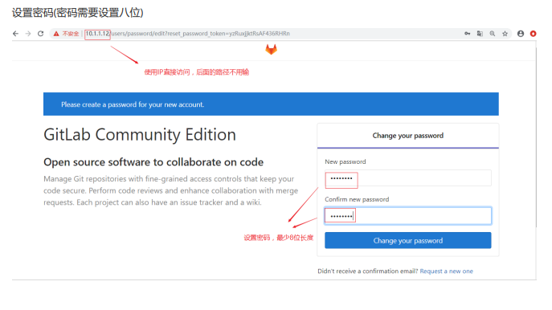
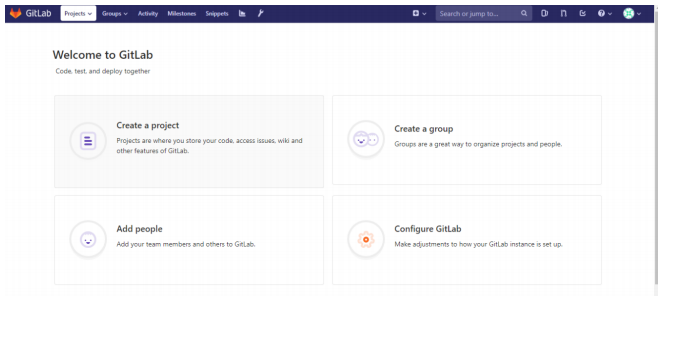
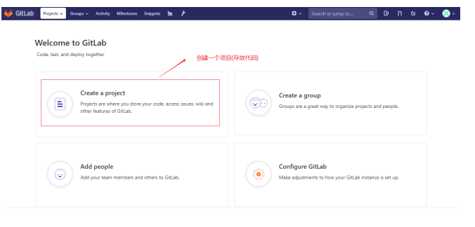
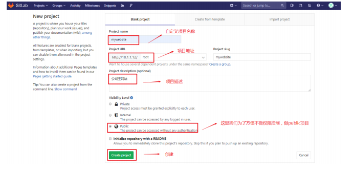
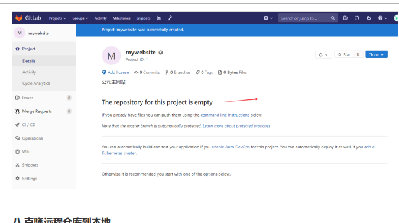
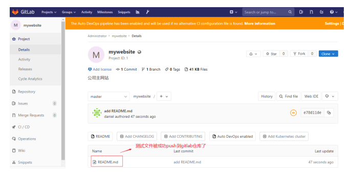

###            gitlab安装


#### 一  安装gitlab(docker)


1. #####   直接拉取gilab-ce镜像,启动容器访问


```
docker pull  gitlab/gitlab-ce:latest 
```


2. #####  创建数据目录用于数据持久化存储


```
mkdir gitlab
mkdir gitlab/config
mkdir gitlab/data
mkdir gitlab/logs
```


3. #####  启动容器


```
sudo docker run \
-d \
--name gitlab --restart always -p 9798:443 -p 9799:80 -p 22:22 \ 
-v /home/gorden/gitlab/config:/etc/gitlab \
-v /home/gorden/gitlab/logs:/var/log/gitlab \
-v /home/gorden/gitlab/data:/var/opt/gitlab \
gitlab/gitlab-ce

```


4. ##### 访问url,登陆gitlab


```
https://10.1.1.2
```








#### 二   gitlab创建仓库


1. #####  在gitlab上创建项目(也就是存放代码的仓库)





2. #####   自定义项目名称，描述等





3. #####  验证





#### 三    克隆远程仓库到本地


       1. ##### 在开发者电脑上设置身份标识


```
[root@vm1 ~]# git config --global user.name "daniel"
[root@vm1 ~]# git config --global user.email "daniel@itcast.cn"
[root@vm1 ~]# git clone git@10.1.1.12:root/mywebsite.git
```


   

2. ##### 在开发者电脑上使用git命令clone，并上传项目


```
[root@vm1 ~]# cd mywebsite/
[root@vm1 mywebsite]# echo "test web" > README.md
[root@vm1 mywebsite]# git add .
[root@vm1 mywebsite]# git commit -m "add README.md"
[root@vm1 mywebsite]# git push -u origin master
```


3. #####  验证





