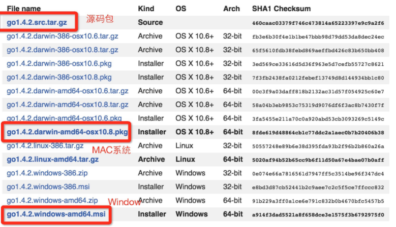

###       Go 语言环境安装


#### 一   Go 语言支持以下系统：

- Linux
- FreeBSD
- Mac OS X
- Windows

​                       

安装包下载地址为：https://golang.google.cn/dl/





#### 二    Windows 系统下安装


Windows 下可以使用 .msi 的安装包来安装(跟着提示一步一步安装)，默认情况下 **.msi** 文件会安装在 **c:\Go** 目录下。


##### 安装测试

1.  创建工作目录 **C:\>Go_WorkSpace**
2. test.go文件代码


```
package main

import "fmt"

func main() {
   fmt.Println("Hello, World!")
}
```


3.  使用 go 命令执行以上代码输出结果如下


```
c:\Go_WorkSpace>go run test.go

Hello, World!
```


