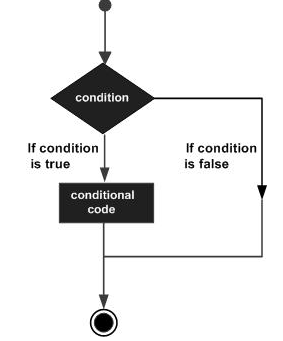

###              Go 语言结构


一   Go 语言的基础组成有以下几个部分：

- 包声明
- 引入包
- 函数
- 变量
- 语句 & 表达式
- 注释


二   实例代码


```
package main

import "fmt"

func main() {
   /* 这是我的第一个简单的程序 */
   fmt.Println("Hello, World!")
}
```


​       


* 第一行 *package main* 定义了包名，表示一个可独立执行的程序。
* *import "fmt"* 告诉 Go 编译器这个程序需要使用 fmt 包（的函数，或其他元素），fmt 包实现了格式化 IO（输入/输出）的函数
*  *func main()* 是程序开始执行的函数。
* /*...*/ 是注释，在程序执行时将被忽略。
* *fmt.Println(...)* 可以将字符串输出到控制台，


### Go语言基础语法


一  GO标记


Go 程序可以由多个标记组成，可以是关键字，标识符，常量，字符串，符号。如以下 GO 语句由 6 个标记组成：


```
fmt.Println("Hello, World!")
```


每行一个标记

```
. fmt
2. .
3. Println
4. (
5. "Hello, World!"
6. )
```


### GO语言数据类型


#####   一    作用：

用于声明函数和变量


#####   二   分类

* 布尔型：值只可以是常量 true 或者 false

* 数字类型：整型 int 和浮点型 float32、float64

* 字符串类型: 串固定长度的字符连接起来的字符序列.

* 派生类型:

  * 指针

  * 数组

  * 结构化

  * Channel

  * 函数

  * 切片

  * 接口

  * Map


### GO语言变量


##### 一   组成形式：由字母、数字、下划线组成，其中首个字符不能为数字。


1. ##### 声明变量的一般形式是使用 var 关键字：


```
var identifier type
```

    2. ##### 可以一次声明多个变量

```
var identifier1, identifier2 type
```


    3. ##### 代码实例


```
package main
import "fmt"
func main() {
    var a string = "Runoob"
    fmt.Println(a)

    var b, c int = 1, 2
    fmt.Println(b, c)
}


```

```
Runoob
1 2
```


####  二   变量声明方法


1.  **指定变量类型，如果没有初始化，则变量默认为零值**。


```
var v_name v_type
v_name = value
```

​      

```
package main
import "fmt"
func main() {

    // 声明一个变量并初始化
    var a = "RUNOOB"
    fmt.Println(a)

    // 没有初始化就为零值
    var b int
    fmt.Println(b)

    // bool 零值为 false
    var c bool
    fmt.Println(c)
}
```

```
RUNOOB
0
false
```


2. #####  根据值自行判断变量类型

```
var v_name = value
```


```
package main
import "fmt"
func main() {
    var d = true
    fmt.Println(d)
}
```

```
true
```


     3. ##### 省略 var, 注意 := 左侧如果没有声明新的变量，就产生编译错误，格式：


```
v_name := value
```


```
package main
import "fmt"
func main() {
    f := "Runoob" // var f string = "Runoob"

    fmt.Println(f)
}
```

​     

```
Runoob 
```


### GO语言常量


#### 一  什么是常量：

1.  常量是一个简单值的标识符，在程序运行时，不会被修改的量。

   常量中的数据类型只可以是布尔型、数字型（整数型、浮点型和复数）和字符串型。

   

          2. 定义格式：

```
onst identifier [type] = value
```


3.  实例


```
package main

import "fmt"

func main() {
   const LENGTH int = 10
   const WIDTH int = 5   
   var area int
   const a, b, c = 1, false, "str" //多重赋值

   area = LENGTH * WIDTH
   fmt.Printf("面积为 : %d", area)
   println()
   println(a, b, c)
```

运行结果

```
面积为 : 50
1 false str
```


#### 二   iota 


1. #####  iota介绍


*  iota，特殊常量，可以认为是一个可以被编译器修改的常量。

* iota 在 const关键字出现时将被重置为 0(const 内部的第一行之前)，const 中每新增一行常量声明将使 iota 计数一次

* 可用于枚举


​    

2. ##### iota用法

```
package main

import "fmt"

func main() {
    const (
            a = iota   //0
            b          //1
            c          //2
            d = "ha"   //独立值，iota += 1
            e          //"ha"   iota += 1
            f = 100    //iota +=1
            g          //100  iota +=1
            h = iota   //7,恢复计数
            i          //8
    )
    fmt.Println(a,b,c,d,e,f,g,h,i)
}
```


运行结果


```
0 1 2 ha ha 100 100 7 8
```


### GO语言运算符


* 算术运算符
* 关系运算符
* 逻辑运算符
* 位运算符
* 赋值运算符
* 其他运算符


#### 一  算术运算符


1. 

| 运算符 | 描述 |
| :----: | :--: |
|   +    |  加  |
|   -    |  减  |
|   *    |  乘  |
|   /    |  除  |
|   %    | 求余 |
|   ++   | 自加 |
|   --   | 自减 |


2. 实例


```
package main

import "fmt"

func main() {

   var a int = 21
   var b int = 10
   var c int

   c = a + b
   fmt.Printf("第一行 - c 的值为 %d\n", c )
   c = a - b
   fmt.Printf("第二行 - c 的值为 %d\n", c )
   c = a * b
   fmt.Printf("第三行 - c 的值为 %d\n", c )
   c = a / b
   fmt.Printf("第四行 - c 的值为 %d\n", c )
   c = a % b
   fmt.Printf("第五行 - c 的值为 %d\n", c )
   a++
   fmt.Printf("第六行 - a 的值为 %d\n", a )
   a=21   
   a--
   fmt.Printf("第七行 - a 的值为 %d\n", a )
}
```


运行结果


```
第一行 - c 的值为 31
第二行 - c 的值为 11
第三行 - c 的值为 210
第四行 - c 的值为 2
第五行 - c 的值为 1
第六行 - a 的值为 22
第七行 - a 的值为 20
```


#### 二  关系运算符


| 运算符 | 描述                                                         |
| :----: | ------------------------------------------------------------ |
|   ==   | 检查两个值是否相等，如果相等返回 True 否则返回 False。       |
|   !=   | 检查两个值是否不相等，如果不相等返回 True 否则返回 False。   |
|   >    | 检查左边值是否大于右边值，如果是返回 True 否则返回 False。   |
|   <    | 检查左边值是否小于右边值，如果是返回 True 否则返回 False。   |
|   >=   | 查左边值是否大于等于右边值，如果是返回 True 否则返回 False   |
|   <=   | 检查左边值是否小于等于右边值，如果是返回 True 否则返回 False。 |


#### 三 逻辑运算符


| 运算符 | 描述                                                         |
| :----: | ------------------------------------------------------------ |
|   &&   | 逻辑 AND 运算符。 如果两边的操作数都是 True，则条件 True，否则为 False。 |
|  \|\|  | 逻辑 OR 运算符。 如果两边的操作数有一个 True，则条件 True，否则为 False |
|   !    | 逻辑 NOT 运算符。 如果条件为 True，则逻辑 NOT 条件 False，否则为 True。 |


实例


```
ackage main

import "fmt"

func main() {
   var a bool = true
   var b bool = false
   if ( a && b ) {
      fmt.Printf("第一行 - 条件为 true\n" )
   }
   if ( a || b ) {
      fmt.Printf("第二行 - 条件为 true\n" )
   }
   /* 修改 a 和 b 的值 */
   a = false
   b = true
   if ( a && b ) {
      fmt.Printf("第三行 - 条件为 true\n" )
   } else {
      fmt.Printf("第三行 - 条件为 false\n" )
   }
   if ( !(a && b) ) {
      fmt.Printf("第四行 - 条件为 true\n" )
   }

```


运行结果:


```
第二行 - 条件为 true
第三行 - 条件为 false
第四行 - 条件为 true
```


#### 四   位运算符


go语言支持的赋值运算符：


|   &    | 按位与运算符"&"是双目运算符。 其功能是参与运算的两数各对应的二进位相与 | （A & B) 结果为 12, 二进制为 0000 1100 |
| :----: | ------------------------------------------------------------ | -------------------------------------- |
|   I    | 按位或运算符"                                                | "                                      |
|   ^    | 按位异或运算符"^"是双目运算符。 其功能是参与运算的两数各对应的二进位相异或，当两对应的二进位相异时，结果为1。 | (A ^ B) 结果为 49, 二进制为 0011 0001  |
|   <<   | 左移运算符"<<"是双目运算符。左移n位就是乘以2的n次方。 其功能把"<<"左边的运算数的各二进位全部左移若干位，由"<<"右边的数指定移动的位数，高位丢弃，低位补0 | A << 2 结果为 240 ，二进制为 1111 0000 |
|   >>   | 右移运算符">>"是双目运算符。右移n位就是除以2的n次方。 其功能是把">>"左边的运算数的各二进位全部右移若干位，">>"右边的数指定移动的位数。 | A >> 2 结果为 15 ，二进制为 0000 1111  |
| 运算符 | 描述                                                         | 实例                                   |


实例


```
ackage main

import "fmt"

func main() {

   var a uint = 60      /* 60 = 0011 1100 */  
   var b uint = 13      /* 13 = 0000 1101 */
   var c uint = 0          

   c = a & b       /* 12 = 0000 1100 */ 
   fmt.Printf("第一行 - c 的值为 %d\n", c )

   c = a | b       /* 61 = 0011 1101 */
   fmt.Printf("第二行 - c 的值为 %d\n", c )

   c = a ^ b       /* 49 = 0011 0001 */
   fmt.Printf("第三行 - c 的值为 %d\n", c )

   c = a << 2     /* 240 = 1111 0000 */
   fmt.Printf("第四行 - c 的值为 %d\n", c )

   c = a >> 2     /* 15 = 0000 1111 */
   fmt.Printf("第五行 - c 的值为 %d\n", c )
}
```


运行结果


```
第一行 - c 的值为 12
第二行 - c 的值为 61
第三行 - c 的值为 49
第四行 - c 的值为 240
第五行 - c 的值为 15
```


#### 五  赋值运算符


| 运算符 | 描述                                           | 实例                                  |
| ------ | ---------------------------------------------- | ------------------------------------- |
| =      | 简单的赋值运算符，将一个表达式的值赋给一个左值 | C = A + B 将 A + B 表达式结果赋值给 C |
| +=     | 相加后再赋值                                   | C += A 等于 C = C + A                 |
| -=     | 相减后再赋值                                   | C -= A 等于 C = C - A                 |
| *=     | 相乘后再赋值                                   | C *= A 等于 C = C * A                 |
| /=     | 相除后再赋值                                   | C /= A 等于 C = C / A                 |
| %=     | 求余后再赋值                                   | C %= A 等于 C = C % A                 |
| <<=    | 左移后赋值                                     | C <<= 2 等于 C = C << 2               |
| >>=    | 右移后赋值                                     | C >>= 2 等于 C = C >> 2               |
| &=     | 按位与后赋值                                   | C &= 2 等于 C = C & 2                 |
| ^=     | 按位异或后赋值                                 | C ^= 2 等于 C = C ^ 2                 |
| \|=    | 按位或后赋值                                   | C \|= 2 等于 C = C \| 2               |


实例


```
package main

import "fmt"

func main() {
   var a int = 21
   var c int

   c =  a
   fmt.Printf("第 1 行 - =  运算符实例，c 值为 = %d\n", c )

   c +=  a
   fmt.Printf("第 2 行 - += 运算符实例，c 值为 = %d\n", c )

   c -=  a
   fmt.Printf("第 3 行 - -= 运算符实例，c 值为 = %d\n", c )

   c *=  a
   fmt.Printf("第 4 行 - *= 运算符实例，c 值为 = %d\n", c )

   c /=  a
   fmt.Printf("第 5 行 - /= 运算符实例，c 值为 = %d\n", c )

   c  = 200; 

   c <<=  2
   fmt.Printf("第 6行  - <<= 运算符实例，c 值为 = %d\n", c )

   c >>=  2
   fmt.Printf("第 7 行 - >>= 运算符实例，c 值为 = %d\n", c )

   c &=  2
   fmt.Printf("第 8 行 - &= 运算符实例，c 值为 = %d\n", c )

   c ^=  2
   fmt.Printf("第 9 行 - ^= 运算符实例，c 值为 = %d\n", c )

   c |=  2
   fmt.Printf("第 10 行 - |= 运算符实例，c 值为 = %d\n", c )

}
```


运行结果


```
第 1 行 - =  运算符实例，c 值为 = 21
第 2 行 - += 运算符实例，c 值为 = 42
第 3 行 - -= 运算符实例，c 值为 = 21
第 4 行 - *= 运算符实例，c 值为 = 441
第 5 行 - /= 运算符实例，c 值为 = 21
第 6行  - <<= 运算符实例，c 值为 = 800
第 7 行 - >>= 运算符实例，c 值为 = 200
第 8 行 - &= 运算符实例，c 值为 = 0
第 9 行 - ^= 运算符实例，c 值为 = 2
第 10 行 - |= 运算符实例，c 值为 = 2
```


#### 六 运算符优先级


| 优先级 | 运算符           |
| ------ | ---------------- |
| 5      | * / % << >> & &^ |
| 4      | + - \| ^         |
| 3      | == != < <= > >=  |
| 2      | &&               |
| 1      | \|\|             |


代码应用


```
package main

import "fmt"

func main() {
   var a int = 20
   var b int = 10
   var c int = 15
   var d int = 5
   var e int;

   e = (a + b) * c / d;      // ( 30 * 15 ) / 5
   fmt.Printf("(a + b) * c / d 的值为 : %d\n",  e );

   e = ((a + b) * c) / d;    // (30 * 15 ) / 5
   fmt.Printf("((a + b) * c) / d 的值为  : %d\n" ,  e );

   e = (a + b) * (c / d);   // (30) * (15/5)
   fmt.Printf("(a + b) * (c / d) 的值为  : %d\n",  e );

   e = a + (b * c) / d;     //  20 + (150/5)
   fmt.Printf("a + (b * c) / d 的值为  : %d\n" ,  e );
```


运行结果


```
(a + b) * c / d 的值为 : 90
((a + b) * c) / d 的值为  : 90
(a + b) * (c / d) 的值为  : 90
a + (b * c) / d 的值为  : 50
```


### GO语言条件语句


#### 一 结构





#### 二 分类


| 语句      | 描述                                                         |
| --------- | ------------------------------------------------------------ |
| if        | **if 语句** 由一个布尔表达式后紧跟一个或多个语句组成。       |
| if...else | **if 语句** 后可以使用可选的 **else 语句**, else 语句中的表达式在布尔表达式为 false 时执行。 |
| if 嵌套   | 你可以在 **if** 或 **else if** 语句中嵌入一个或多个 **if** 或 **else if** 语句。 |
| switch    | **switch** 语句用于基于不同条件执行不同动作。                |
| select    | **select** 语句类似于 **switch** 语句，但是select会随机执行一个可运行的case。如果没有case可运行，它将阻塞，直到有case可运行。 |


