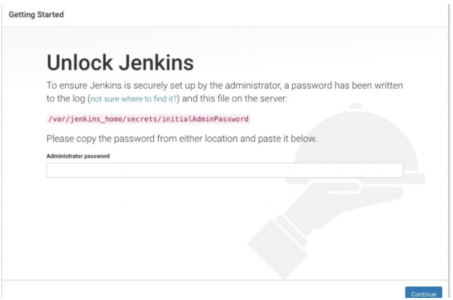
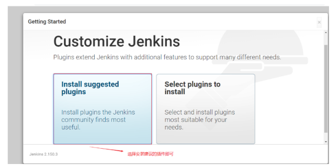
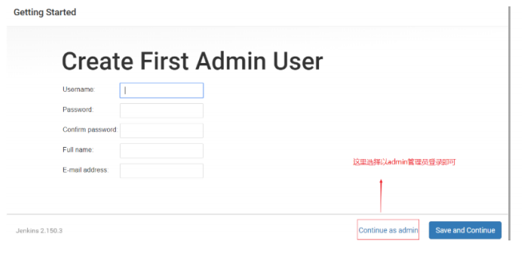
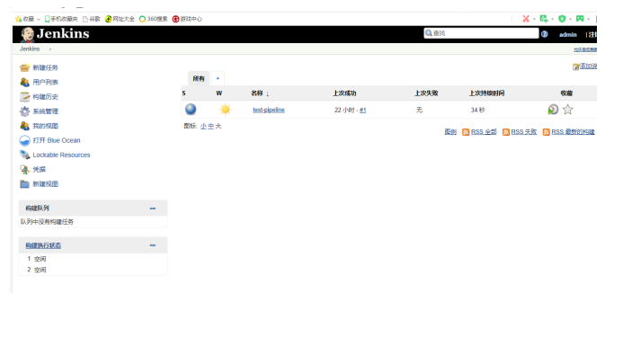

### jenkins安装（docker)


#### 一  环境准备


1. 系统 centos7.6 内存1g 50g可用磁盘空间
2.  ip 192.168.150.183


#### 二  安装步骤


1. #####  到docker官方镜像仓库中拉取jenkins应用镜像


```
docker pull jenkinsci/blueocean
```


2. ##### docker 启动容器运行jenkins


```
docker run \
-u root \
--rm \
-d \
-p 8080:8080 \
-p 50000:50000 \
-v jenkins-data:/var/jenkins_home \
-v /var/run/docker.sock:/var/run/docker.sock \
jenkinsci/blueocean
```


    3. ##### 访问url :  http://192.168.150.183:8080

​       第一次访问新的Jenkins实例时，系统会要求您使用自动生成的密码对其进行解锁。





4. ##### 从Jenkins控制台日志输出中，复制自动生成的字母数字密码到密码框中


```
docker logs gallant_kirch # gallant_kirch： 运行jenkins的容器name
```


5. ##### 选择推荐安装的插件





6. #####    创建新管理员用户(创建了新的管理员用户后，原来的admin用户就不能用了)，也可直接使用初始管理员admin登陆





7. #####  进入jenkins主界面





