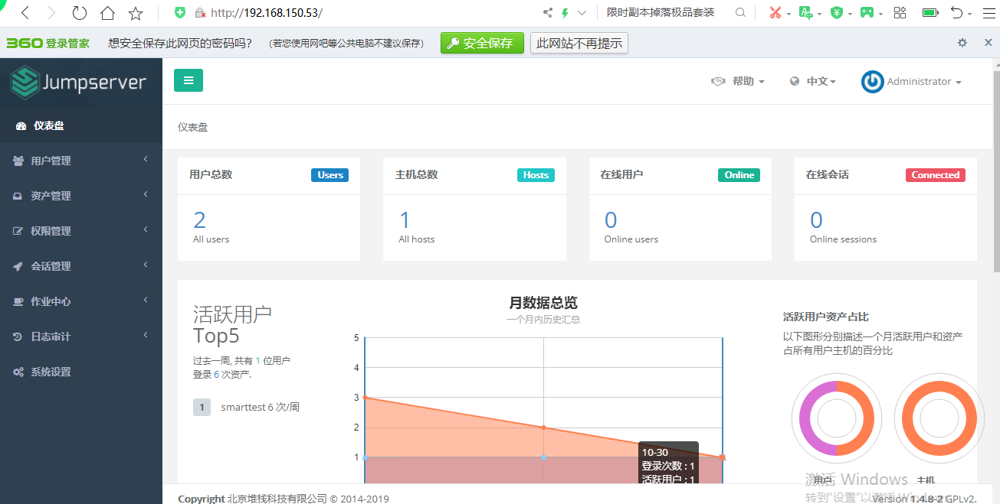

###         jumpserver  安装


#### 一    环境要求

硬件配置：2个cpu核心，4G内存，50G硬盘（最低）
操作系统: linux 发行版x86_64
python= 3.6x

mysql server>=5.6
redis


#### 二  安装步骤


1. 防火墙 与 selinux 设置


```
systemctl start firewalld
firewall-cmd --zone=public --add-port=80/tcp --permanent # nginx 端口
firewall-cmd --zone=public --add-port=2222/tcp --permanent # 用户SSH登录端口 koko
firewall-cmd --reload # 重新载入规则
setenforce 0
sed -i "s/SELINUX=enforcing/SELINUX=disabled/g" /etc/selinux/config
```


2. 安装依赖包

​          

```
yum -y install wget gcc epel-release git

```

3. 安装 Redis, Jumpserver 使用 Redis 做 cache 和 celery broke


 

```
yum -y install redis
systemctl enable redis
systemctl start redis
```

4. 安装mysql

   ```
   yum -y install mariadb mariadb-devel mariadb-server MariaDB-shared # centos7下叫mariadb,
   
   systemctl enable mariadb
   systemctl start mariadb
   ```


5.    创建数据库 Jumpserver 并授权

 

```
DB_PASSWORD=`cat /dev/urandom | tr -dc A-Za-z0-9 | head -c 24` # 生成随机数据库密码
mysql -uroot -e "create database jumpserver default charset 'utf8'; grant all
jumpserver.* to 'jumpserver'@'127.0.0.1' identified by '$DB_PASSWORD'; flush
privileges;"

```


6. ​      安装 Python3.6，   配置并载入 Python3 虚拟环境


```
yum -y install python36 python36-devel
cd /opt
python3.6 -m venv py3 # py3 为虚拟环境名称, 可自定义
source /opt/py3/bin/activate # 退出虚拟环境可以使用 deactivate 命令
```


   

7.    下载 jumpserver项目


```
cd /opt/
git clone --depth=1 https://github.com/jumpserver/jumpserver.git
```


8.    安装依赖rpm包


```
yum -y install $(cat /opt/jumpserver/requirements/rpm_requirements.txt)

```


9. ​    安装 Python 库依赖


```
pip install --upgrade pip setuptools
pip install -r /opt/jumpserver/requirements/requirements.txt
```


10.    修改jumpserver配置文件


```
cd /opt/jumpserver
cp config_example.yml config.yml
SECRET_KEY=`cat /dev/urandom | tr -dc A-Za-z0-9 | head -c 50` # 生成随机SECRET_KEY
echo "SECRET_KEY=$SECRET_KEY" >> ~/.bashrc
BOOTSTRAP_TOKEN=`cat /dev/urandom | tr -dc A-Za-z0-9 | head -c 16` # 生成随机
BOOTSTRAP_TOKEN
echo "BOOTSTRAP_TOKEN=$BOOTSTRAP_TOKEN" >> ~/.bashrc
sed -i "s/SECRET_KEY:/SECRET_KEY: $SECRET_KEY/g" /opt/jumpserver/config.yml
sed -i "s/BOOTSTRAP_TOKEN:/BOOTSTRAP_TOKEN: $BOOTSTRAP_TOKEN/g"
/opt/jumpserver/config.yml
sed -i "s/# DEBUG: true/DEBUG: false/g" /opt/jumpserver/config.yml
sed -i "s/# LOG_LEVEL: DEBUG/LOG_LEVEL: ERROR/g" /opt/jumpserver/config.yml
sed -i "s/# SESSION_EXPIRE_AT_BROWSER_CLOSE: false/SESSION_EXPIRE_AT_BROWSER_CLOSE:
true/g" /opt/jumpserver/config.yml
sed -i "s/DB_PASSWORD: /DB_PASSWORD: $DB_PASSWORD/g" /opt/jumpserver/config.yml
```


11. ​     运行jumpserver


```
cd /opt/jumpserver
./jms start -d
```


12.    安装 Nginx, 用作代理服务器整合 Jumpserver 与各个组件


```
vi /etc/yum.repos.d/nginx.repo
[nginx]
name=nginx repo
baseurl=http://nginx.org/packages/centos/7/$basearch/
gpgcheck=0
enabled=1

```


13 .   配置 Nginx 整合各组件


```
rm -rf /etc/nginx/conf.d/default.conf
vi /etc/nginx/conf.d/jumpserver.conf
server {
listen 80;
client_max_body_size 100m; # 录像及文件上传大小限制
location /luna/ {
try_files $uri / /index.html;
alias /opt/luna/; # luna 路径, 如果修改安装目录, 此处需要修改
}
location /media/ {
add_header Content-Encoding gzip;
root /opt/jumpserver/data/; # 录像位置, 如果修改安装目录, 此处需要修改
}
location /static/ {
root /opt/jumpserver/data/; # 静态资源, 如果修改安装目录, 此处需要修改
}
location /koko/ {
proxy_pass http://localhost:5000;
```


```
proxy_buffering off;
proxy_http_version 1.1;
proxy_set_header Upgrade $http_upgrade;
proxy_set_header Connection "upgrade";
proxy_set_header X-Real-IP $remote_addr;
proxy_set_header Host $host;
proxy_set_header X-Forwarded-For $proxy_add_x_forwarded_for;
access_log off;
}
location /guacamole/ {
proxy_pass http://localhost:8081/;
proxy_buffering off;
proxy_http_version 1.1;
proxy_set_header Upgrade $http_upgrade;
proxy_set_header Connection $http_connection;
proxy_set_header X-Real-IP $remote_addr;
proxy_set_header Host $host;
proxy_set_header X-Forwarded-For $proxy_add_x_forwarded_for;
access_log off;
}
location /ws/ {
proxy_pass http://localhost:8070;
proxy_http_version 1.1;
proxy_buffering off;
proxy_set_header Upgrade $http_upgrade;
proxy_set_header Connection "upgrade";
proxy_set_header X-Real-IP $remote_addr;
proxy_set_header Host $host;
proxy_set_header X-Forwarded-For $proxy_add_x_forwarded_for;
access_log off;
}
location / {
proxy_pass http://localhost:8080;
proxy_set_header X-Real-IP $remote_addr;
proxy_set_header Host $host;
proxy_set_header X-Forwarded-For $proxy_add_x_forwarded_for;
access_log off;
}
}
```


运行 nginx 

```
nginx -t
systemctl start nginx
```


14 .   

```
访问url  http://192.168.150.53
```





