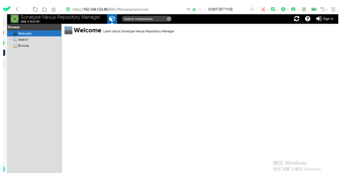

### nexus安装步骤


1. ​     下载最新版的nexus，下载地址 [nexus]( https://www.sonatype.com/download-oss-sonatype)

2. ​      安装jdk1.8以上版本

3. ​    解压软件包到指定目录下，我这里解压到/usr/local下


```
[root@localhost src]# tar zxvf nexus-3.5.2-01-unix.tar.gz -C /usr/local/
```

  

4.    创建nexus用户,因为默认不能在root用户下启动nexus


```
[root@localhost src]# useradd nexus

```

​     

5. ​        把nexus安装目录属主改为nexus


```
[root@localhost src]# chown nexus:nexus -R nexus-3.13.0-01
```


6. ​       切换到nexus用户，在bin目录下启动nexus


```
[root@localhost src]# cd /usr/local /nexus-3.13.0-01/bin

```

```
[nexus@localhost bin]$ ./nexus run
Started Sonatype Nexus
```


     7.    查看8081端口是否启动


        ```
        [root@localhost ~]# netstat -nltp | grep 8081
        
        tcp    0          0 0.0.0.0:8081    0.0.0.0:*         LISTEN 63087/java
        ```


      8. 访问url: 
    
         ```
         http://192.168.150.48:8081
         ```





