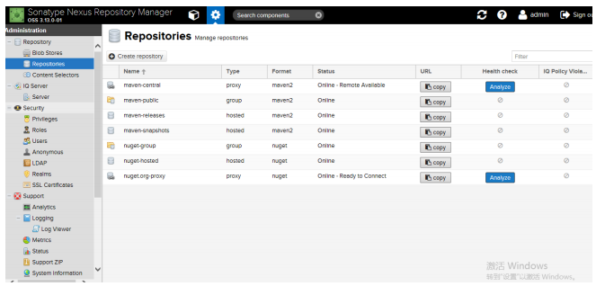
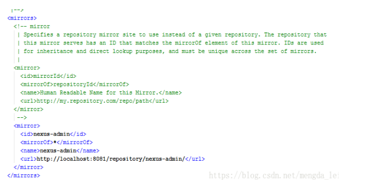
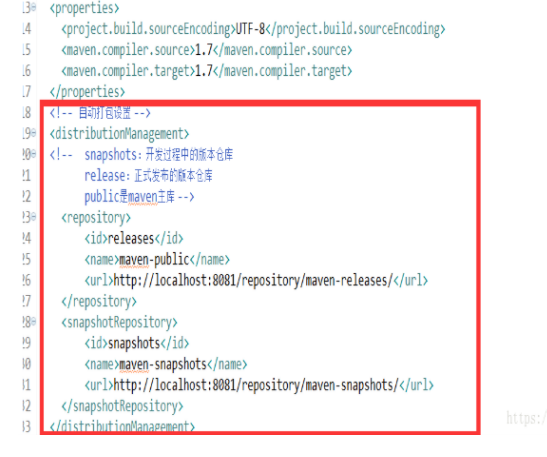
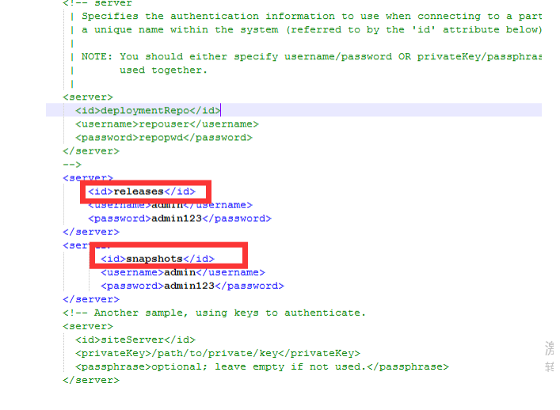
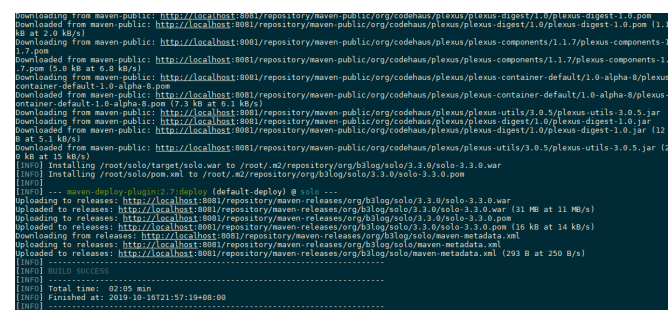
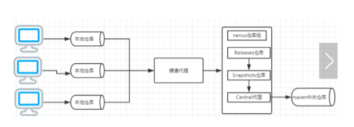
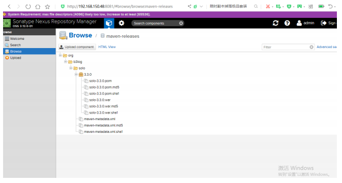

###                             nexus 配置私服


#### 一   配置maven私服


* 打开管理平台，并使用管理用户登录
* 进入管理页面，并进入仓库管理，对仓库进行增删。新装的nexus默认仓库如图





* hostd: 为项目自己创建的仓库，上传自己开发好的jar包

* group：为仓库组，项目直接引用的仓库

* proxy:为远程引用仓库


#####  注意：

#####                  

```
maven-central：maven中央库，默认从https://repo1.maven.org/maven2/拉取jar
maven-releases：私库发行版jar （上线时用）
maven-snapshots：私库快照（调试版本，开发时用）jar
maven-public：仓库分组，把上面三个仓库组合在一起对外提供服务，在本地maven基础配置settings.xml
中使用
```


#### 二     项目运用私服(maven)


* 步骤：

       1. ##### settings.xml直接引用仓库组：如下url为仓库组的url





2. #####  pom文件自动打包设置，如下pom中发布jar的repository的id与settings.xml文件中server中id一样。url为私服库对应地址


​       







        3. ##### 项目打包发布到私服

           ```
           [root@localhost solo]# mvn deploy
           ```





4. #####  使用私服后仓库的访问顺序





5. #####  nexus仓库上上验证





