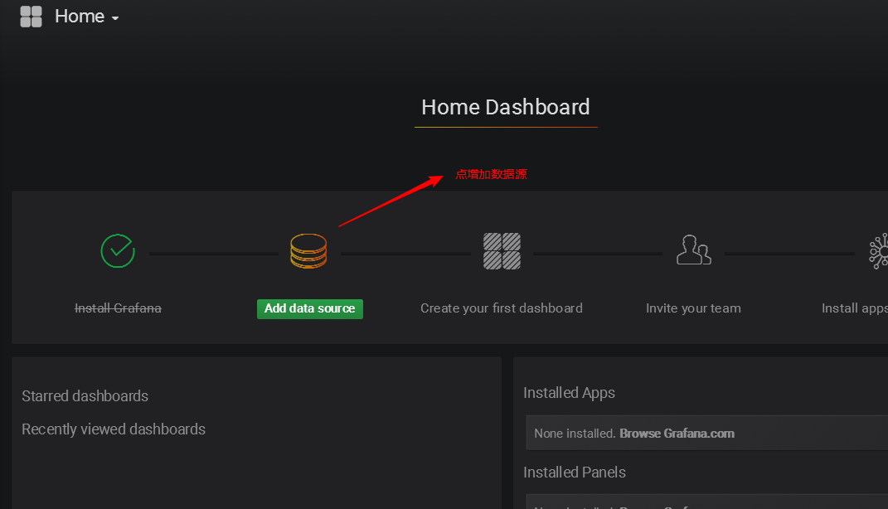
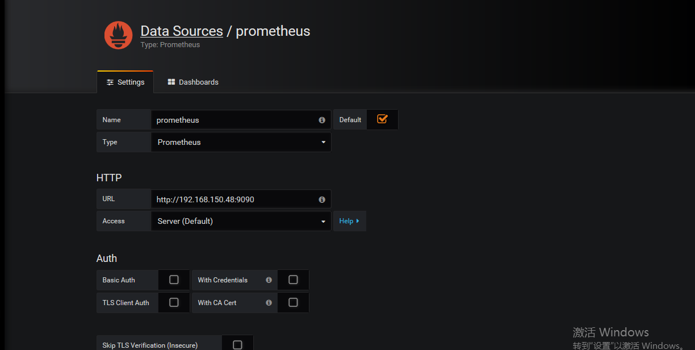
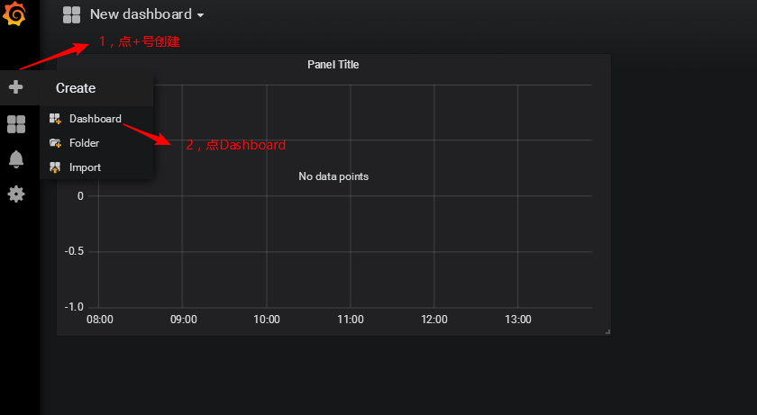
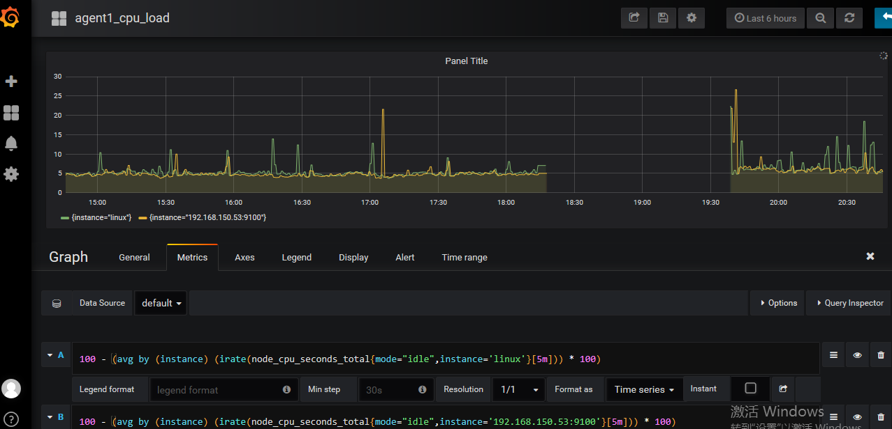
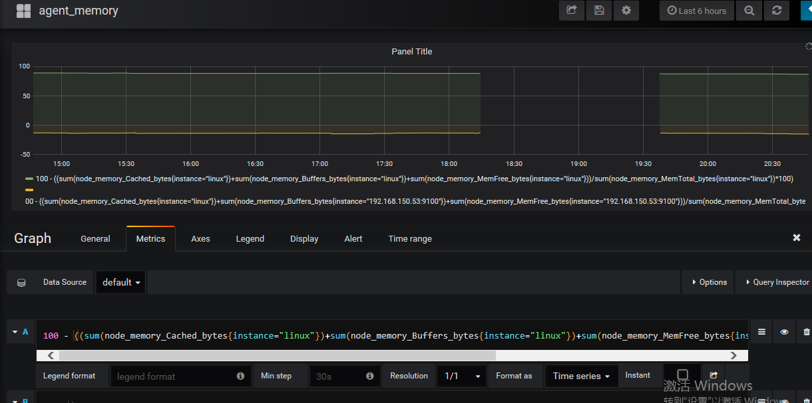
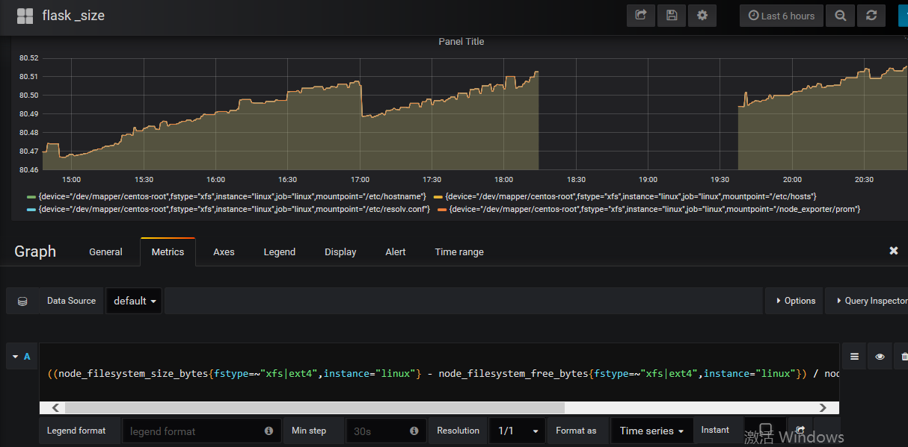

###             使用grafana连接prometheus并图形展示监控数据

​                               

##### 步骤：

​           1 ：将prometheus服务器收集到的数据作为数据源添加到grafana中。这样可以得到prometheus的数据

name名字写Prometheus

type 选择Prometheus，因为数据都从它那里获取

url 输入Prometheus的ip+端口

 

点击下面的Save & Test，如果出现绿色的，说明ok了

2    为添加好的数据源做图形显示

3          通过填写查询语句得到想要监控的数据，cpu,内存，磁盘的使用情况

