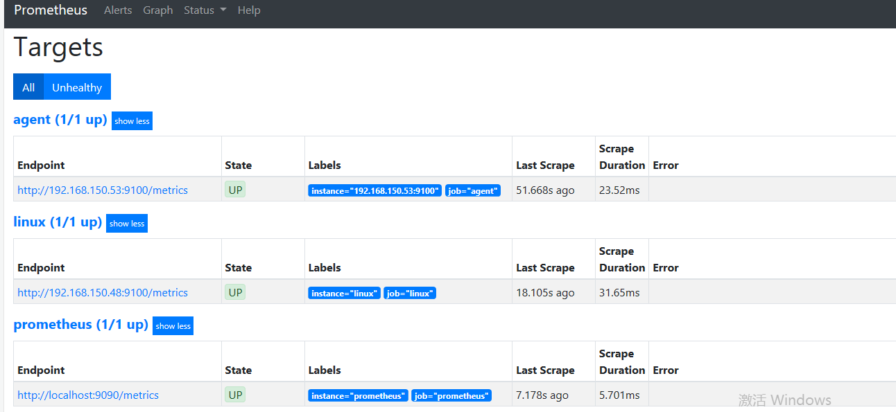

### 快速安装（docker版）


##### 1   下载镜像包

   ​               

```
ocker pull prom/node-exporter   #  该镜像用于主机系统数据的收集
docker pull prom/prometheus
docker pull grafana/grafana
```


##### 2   启动node-exporter


```
docker run -d -p 9100:9100 \
  -v "/proc:/host/proc:ro" \
  -v "/sys:/host/sys:ro" \
  -v "/:/rootfs:ro" \
    prom/node-exporter
```


##### 3   检查9100端口是否启动

​      

```
lsof -i:9100
```


##### 4      访问 url     

```
http://192.168.150.53:9100/metrics   # 可以看到收集到的数据，有了它可以做数据展示
```

​                              


##### 5    启动prometheus


​     新建目录prometheus，编辑配置文件prometheus.yml

```
mkdir /opt/prometheus
cd /opt/prometheus/
vim prometheus.yml
```


```
global:
  scrape_interval:     60s          # 获取数据的时间间隔
  evaluation_interval: 60s          # 分析数据时间间隔

scrape_configs:
  - job_name: prometheus
    static_configs:
      - targets: ['localhost:9090']

  - job_name: linux
    static_configs:
      - targets: ['192.168.150.48:9100'] # 此处ip地址就是本机loacalhost
        labels:
          instance: linux

  - job_name: agent
    static_configs:
      - targets: ['192.168.150.53:9100']     # 远程被监控机器

```


启动 prometheus 


​         

```
docker run  -d \
  -p 9090:9090 \
  -v /opt/prometheus/prometheus.yml:/etc/prometheus/prometheus.yml  \
  prom/prometheus
```


查看9090端口状态


  

```
lsof -i:9090
```


访问url：

```
http://192.168.150.48:9090/graph
```


​           


##### 6  启动grafana 


​          新建空文件夹grafana-storage，用来存储数据​  

​      

```
mkdir /opt/grafana-storage
```

​           

​        设置权限


```
chmod 777 -R /opt/grafana-storage       #grafana用户会在该目录写入文件
```


​      启动grafana

​    

```
docker run -d \
  -p 3000:3000 \
  --name=grafana \
  -v /opt/grafana-storage:/var/lib/grafana \
  grafana/grafana
```


​       查看3000端口启动状态


```
lsof -i:3000
```


访问 url 

​      

```
http://192.168.150.48:3000/  
```


   


