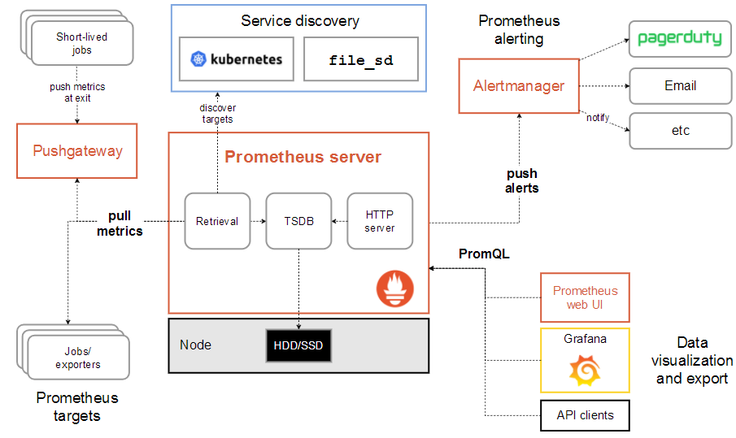

#### 介绍prometheus

Prometheus（普罗米修斯）是一套开源的监控&报警&时间序列数据库的组合,基本原理是通过HTTP协议周期性抓取被监控组件的状态.

输出被监控组件信息的HTTP接口被叫做exporter 

#### Prometheus架构图

​               

服务过程：Prometheus daemon负责定时去目标上抓取metrics(指标) 数据，每个抓取目标需要暴露一个http服务的接口给它定时抓取。

#####          组件介绍：

* Alertmanager：是独立于Prometheus的一个组件，可以支持Prometheus的查询语句，提供报警功能

* PushGateway：这个组件是支持Client主动推送metrics到PushGateway，而Prometheus只是定时去* Gateway上抓取数据。类似于zabbix中的代理agent-proxy

* granfana:  一个开源的功能丰富的数据可视化平台，通常用于时序数据的可视化

* prometheus server : 接收数据(Retrieval)，数据存储在时间序列数据库里(TSDB)，对外展示数据（HTTP server)

