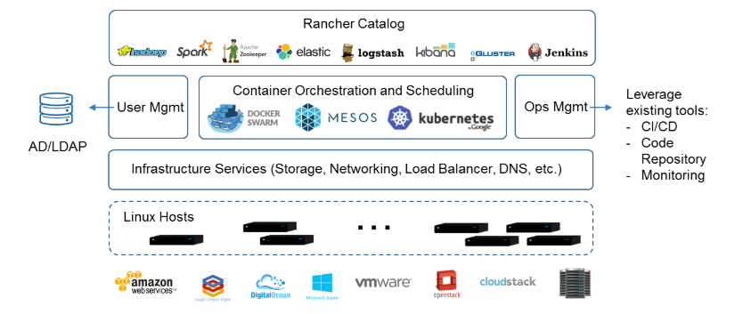

###    一    rancher概览

一个开源的容器管理平台，而且提供了在生产环境中使用的管理Docker和Kubernetes的全栈化容器部署与管理平台。

   

###  二    rancher结构组成

* #####  基础设施编排 :  网络，存储， 编排，负载均衡，DNS

* #####  容器编排与调度：docker swarm和kubernetes

* #####  应用商店： 提供多个容器组成的应用

* #####  企业级权限管理： 支持Active Directory，LDAP， Github认证方式

### 三   rancher组件功能图

