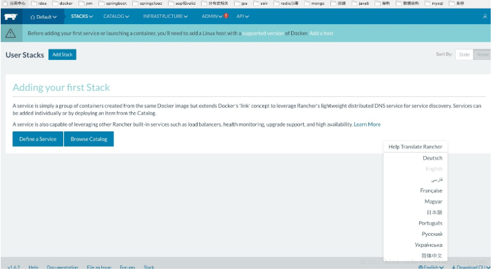
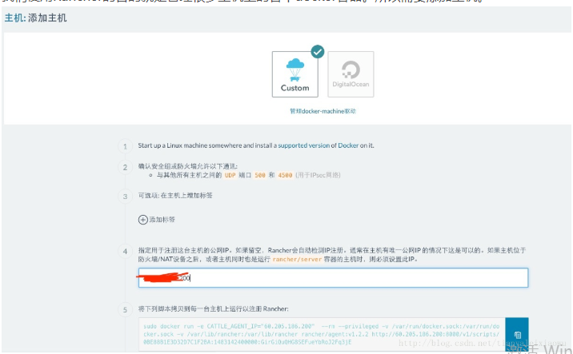
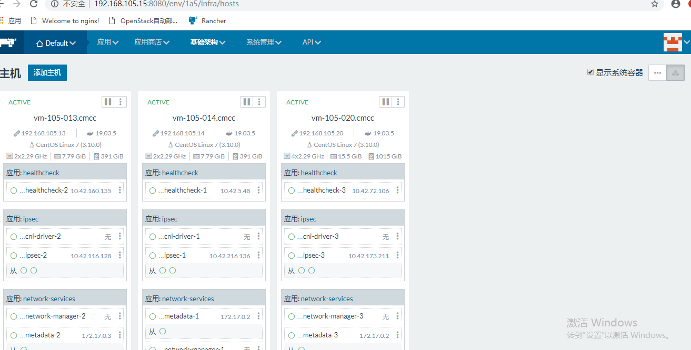

###      rancher 部署安装


#### 一   准备linux主机


操作系统：centos7.7  ,  内核要求不能低于3.10，docker环境


##### 二   启动 rancher server


```
docker run -d --restart=unless-stopped -p 8080:8080 rancher/server:stable
```


##### 三  访问 url :   http://192.168.105.15:8080





#### 四   添加主机





图上第5步是在主机上安装Rancher的客户端，让Rancher好发现并管理该主机。运行第5步后，docker会下载rancher-agent镜像





