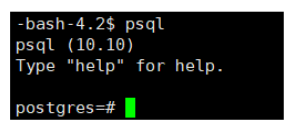
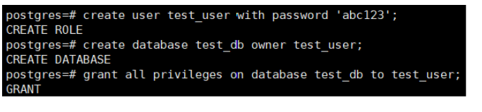
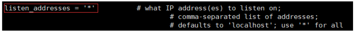
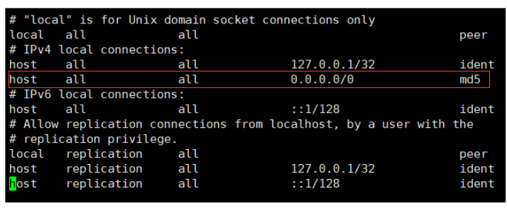
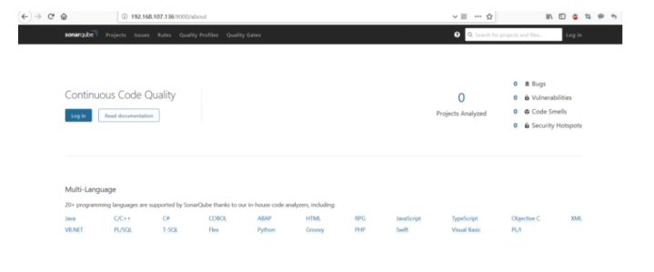

### sonaqube server 搭建


#### 步骤：


首先下载sonaqube安装包，：http://www.sonarqube.org/downloads/ 此处我下载的是最新版7.9


#### 一     安装postgresql数据库


1. #####   安装rpm文件


```
yum install https://download.postgresql.org/pub/repos/yum/reporpms/EL-7-x86_64/pgdgredhat-repo-latest.noarch.rpm
```


2. ##### 安装客户端


```
yum install postgresql10
```


3. ##### 安装服务端


```
yum install postgresql10-server
```


4. #####  初始化


```
/usr/pgsql-10/bin/postgresql-10-setup initdb
```


5. ##### 设置自动启动并且启动postgresql服务


```
systemctl enable postgresql-10
systemctl start postgresql-10
```


#### 二  创建用户和数据库


1. ##### 使用postgres用户登录（PostgresSQL安装后会自动创建postgres用户，无密码）


```
su - postgres
```


    2. ##### 登陆postgresql 数据库




3. ##### 创建数据库 用户并授权


```
create user test_user with password 'abc123'; // 创建用户
create database test_db owner test_user; // 创建数据库
grant all privileges on database test_db to test_user; // 授权
```





#### 三 开启远程访问


1. ##### 修改/var/lib/pgsql/10/data/postgresql.conf文件，取消 listen_addresses 的注释，将参数值改为“*





2. ##### 修改/var/lib/pgsql/10/data/pg_hba.conf文件，增加下图红框部分内容





3. #####  切换到root用户，重启postgresql服务


```
systemctl restart postgresql-10.service
```


#### 四   配置sonaqube 


1. ##### 解压SonarQube压缩包


```
unzip /var/ftp/pub/sonarqube-7.9.1.zip
```


2. #####   修改 $SONARQUBE_HOME/conf/sonar.properties 文件，更改数据连接配置


```
sonar.jdbc.username=test_user
sonar.jdbc.password=abc123
sonar.jdbc.url=jdbc:postgresql://localhost:5432/test_db
```


3. #####  创建一个sonar用户 （SonarQube内置了elasticsearch，elasticsearch不允许使用root用户启动）、


```
useradd sonarqube
passwd sonarqube
```


4. ##### 设置系统参数（elasticsearch启动需要设置一些参数）


5. #####  赋予启动用户执行权限


```
chown -R sonarqube:sonarqube /usr/local/sonarqube-7.9.1/
```


6. ##### 登陆启动用户并启动程序


```
su - sonarqube // 以sonarqube用户登陆
cd /usr/local/sonarqube-7.9.1/bin/linux-x86-64 // 进入启动命令目录
./sonar.sh start
```


7. ##### 登陆http://192.168.107.136:9000访问，默认用户名/密码为：admin/admin




